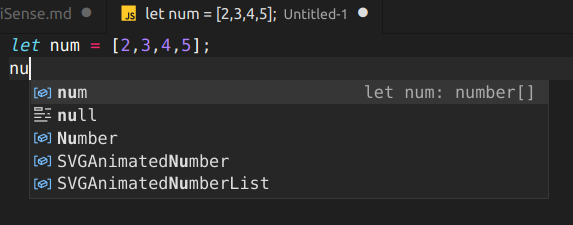

### IntelliSense

El concepto de IntelliSense en Visual Studio Code se lo asocia a un conjunto de funcionalidades de edición de código que incluyen por ejemplo: sugerencia de métodos y propiedades de un objeto, información de parámetros y sus tipos etc.

Visual Studio Code trae esta funcionalidad por defecto para los lenguajes JavaScript, TypeScript, CSS, HTML JSON, Less y Sass. Luego veremos que existen muchas "extensiones" que pueden agregar la funcionalidad de IntelliSense a lenguajes tan disímiles como Python, Java, C#, Go, SQL etc.

Segun vamos escribiendo nos van apareciendo sugerencias, Si nos interesa alguna pinchamos sobre ella y nos autocompleta el código como vemos a continuacion:

Tambien te autocompleta con las variables y metodos que creas en el archivo:

