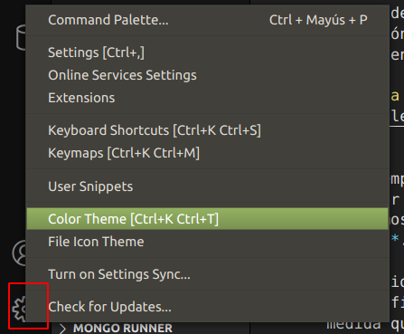
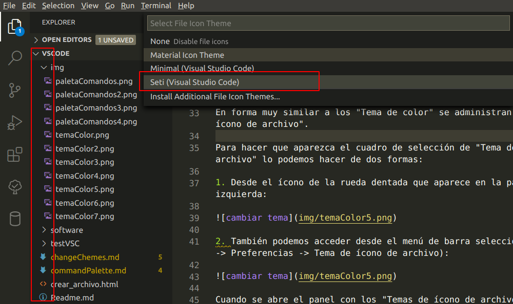

### Cambiar tema

### Tema de color

Para hacer que aparezca el cuadro de selección de tema podemos hacerlo de tres formas:

1. Desde el ícono de la rueda dentada que aparece en la parte inferior izquierda:

2. También podemos acceder desde el menú de barra seleccionando (Archivo -> Preferencias -> Tema de Color):

3. Mediante las teclas (Ctrl + K, Ctrl + T):

Cuando se abre el panel con los "Temas de color" mediante las teclas de flechas o el mouse podemos ir seleccionando cada uno y ver como se actualiza en tiempo real la interfaz de VSCode:

Tambien podemos instalar nuevos temas desde extensiones.

Escribimos *theme* y escojemos el que nos interese inatalar y le damos a instalar

Nos mostrara algo parecido a esto para que escojamos el tema

#### Tema de ícono de archivo

En forma muy similar a los "Tema de color" se administran los "Temas de ícono de archivo".

Para hacer que aparezca el cuadro de selección de "Tema de ícono de archivo" lo podemos hacer de dos formas:

1. Desde el ícono de la rueda dentada que aparece en la parte inferior izquierda:

2. También podemos acceder desde el menú de barra seleccionando (Archivo -> Preferencias -> Tema de ícono de archivo):

Cuando se abre el panel con los "Temas de ícono de archivo" mediante las teclas de flechas o el mouse podemos ir seleccionando cada uno y ver como se actualiza en tiempo real la interfaz de VSCode:

Como en el tema de color tambien puedes intalar nuevos temas de icones desde extensiones.