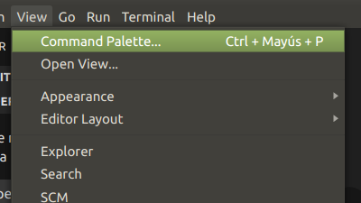

### Paleta de Comamdos

Es una herramienta que nos provee VSCode donde podemos acceder a todas las funcionalidades.

Tenemos que buscar la funcionalidad escribiendo su descripción.

Para hacer que aparezca la paleta de comandos podemos lanzarla de cuatro formas:

1. Desde el ícono de la rueda dentada que aparece en la parte inferior izquierda:

2. También podemos acceder a la "paleta de comandos" desde el menú de barra seleccionando (Ver -> Paleta de comandos...):

3. Podemos abrir la "Paleta de comandos" mediante la tecla (F1):

4. Finalmente en cualquier momento podemos abrir la "Paleta de comandos" mediante las teclas (Ctrl + Shift + P):

La "Paleta de comandos" aparece en pantalla en forma centrada y en su editor debemos escribir la acción que queremos hacer dentro de VSCode:

Por ejemplo si queremos recargar la ventan empezamos a escribir *reload*.

La cantidad de comandos se van filtrando a medida que ingresamos una o más palabras. Una vez que la ubicamos hacemos clic sobre la misma, recargara la ventana.

