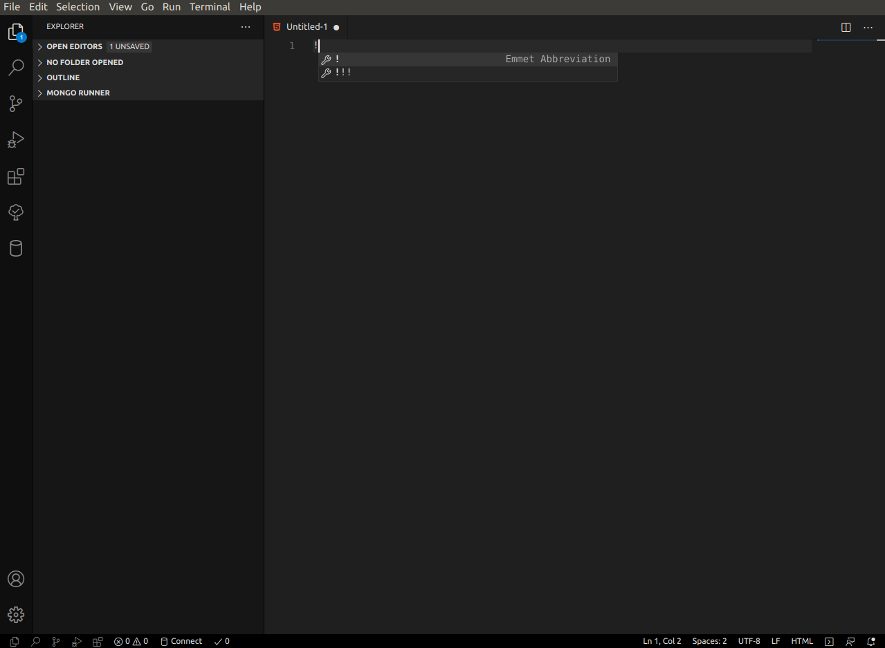
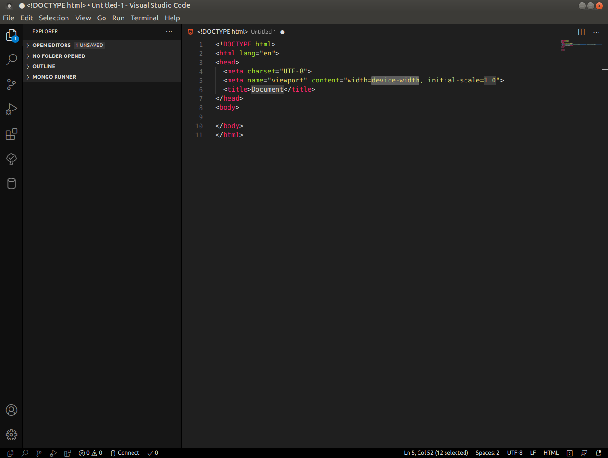
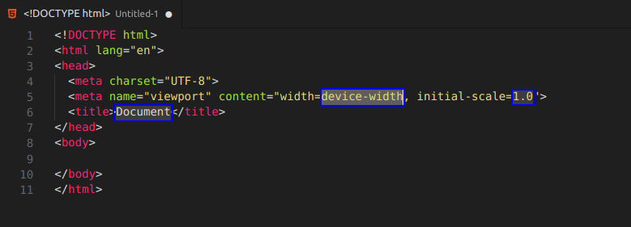
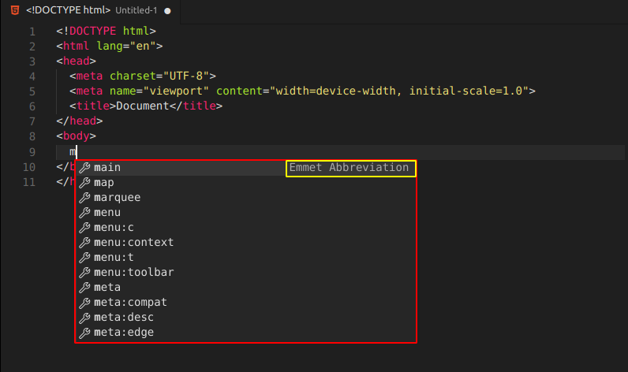

### Escritura de HTML y CSS con Emmet

Emmet es un plugin (que ya viene integrado en VSCode) que te permite escribir código HTML y CSS por medio de abreviaturas, haciendo que podamos maquetar de forma rápida cualquier pagina o sitio web que estemos por realizar.

####HTML con Emmet

Consiste en insertar ciertos caracteres y que el editor VSCode nos sugiera una cadena que sustituya dichos caracteres. Veamos con un ejemplo como funciona, creemos un archivo vacío html y dentro del editor escribamos el caracter '!':

Luego si presionamos la tecla "Enter" se sustituye el caracter '!' por el código:

También luego de dar "Enter" quedan ciertas partes del bloque generado con otro color, mediante la tecla 'Tab' podemos ir avanzando y cambiando los valores propuestos como por ejemplo el valor para la marca 'title':

Gracias a Emmet podremos crear fácilmente código a través de etiquetas. Insertando un carácter, inmediatamente se nos sugieren distintos valores por los que podemos sustituir dicho caracter.

--------------
####CSS con Emmet

Para visualizar Emmet en CSS lo mostraremos a partir de un ejemplo. Crearemos primero en nuestro proyecto una carpeta llamada 'css' y dentro de ella un archivo llamado 'estilos.css'.

Simplemente disponiendo en la página HTML la marca 'link' aparece la sugerencia de 'Emmet' para generar toda la etiqueta:

Luego cuando tenemos que disponer el 'path' o camino donde se encuentra el archivo 'css' el mismo VSCode nos propone el nombre de la carpeta y seguidamente la selección del archivo de dicha carpeta:

