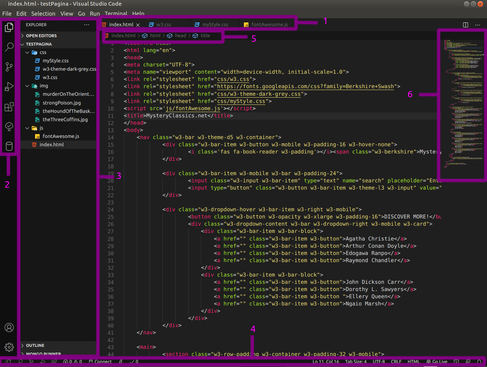

### Explicar área de trabajo

El interfaz de Visual Studio Code contiene varios elementos principales en su ventana de edición de código. Los elementos más importantes de la interfaz de usuario son:

1. Pestañas de editores: muestra las ventanas de edición abiertas. El editor es el área principal y más grande, con paneles de edición que pueden verse simultáneamente y con el tipo de disposición que desee el usuario. Para abrir una ventana de edición y que se vea al lado de otra, se hace click derecho en el archivo en la barra lateral y se selecciona "Open to the Side". Se pueden abrir tantas ventanas de edición como se deseen.
 

2. Barra de actividades/Vistas: las vistas son las diferentes áreas de actividades que se pueden abrir en Visual Studio Code, distribuidas en iconos en una barra lateral. La Vista activa en la captura de pantalla es la de Explorador, que muestra todos los archivos del proyecto, pero Visual Studio Code viene con las siguientes Vistas por defecto: Exporador, Buscar, Control de Versiones, Depurador y Extensiones. Ciertas extensiones pueden añador Vistas nuevas a la barra de actividades.
 

3. Explorador: el Explorador se utiliza para navegar en, abrir y gestionar todos los archivos y carpetas de un proyecto. Tras abrir una carpeta con el programa, todo su contenido será mostrado en la barra del Explorador. Usando el Explorador se puede:
    - Crear, borrar y renombrar ficheros o carpetas.
    - Mover ficheros y carpetas mediante arrastre y depósito.
 

4. Barra de estado: muestra información sobre el proyecto abierto y los archivos que se están editando en ese momento.
 

5. "Breadcrumbs"/"migas de pan": barra de navegación que muestra en qué rama del archivo a editar nos encontramos, y permite navegar entre carpetas, archivos y símbolos.
 

6. Minimapa: permite previsualizar desde un nivel de perspectiva superior todo el código escrito en el archivo, lo cual ayuda a navegar entre el código más rápidamente y entender mejor la estructura del código realizado hasta el momento.