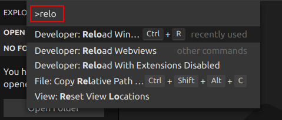
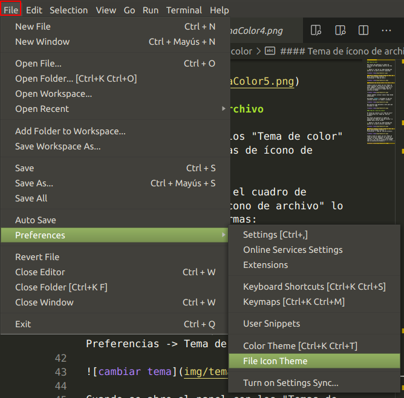

 
### Características generales de VS Code
 
VS Code es un editor de código fuente ligero pero potente que se ejecuta en el escritorio y está disponible para Windows, macOS y Linux. Tiene soporte nativo para JavaScript, TypeScript y Node.js. Pero no solo esto, sino que tiene un brutal ecosistema de complementos que permite trabajar con casi cualquier lenguaje de programación, C, C#, Java, Python, PHP, GO, etc.
 

 
Combina la interfaz de usuario optimizada de un editor moderno con asistencia y navegación de código enriquecido y una experiencia de depuración integrada. VS Code cuenta con herramientas de Debug hasta opciones para actualización en tiempo real de nuestro código en la vista del navegador y compilación en vivo de los lenguajes que lo requieran. Además de las extensiones, tendremos la posibilidad de optar por otros themes o bien configurarlo a nuestro gusto.
 
##### Ventajas de VS Code
 
- VS Code es una herramienta que tiene soporte nativo para gran variedad de lenguajes, entre ellos podemos destacar: HTML, CSS, Javascript, Jquery, PHP, TypeScript, LESS, SCSS, Python, C++, Java...entre otros.
- Autoguardado instantáneo.
- Infinidad de extensiones, la mayoría gratuitas.
- Posibilidad de configurar la interfaz a nuestro gusto. De esta forma, podremos tener más de un código visible al mismo tiempo, las carpetas de nuestro proyecto y también acceso a la terminal o un detalle de problemas, entre otras posibilidades.
- Existencia de una amplísima gama de temas o estilos visuales para VS Code, que hacen el trabajo con el software más agradable a la vista.
- Goza de un soporte técnico formidable pues debido a su frecuente uso por la comunidad de desarrolladores, se puede encontrar fácilmente documentación y ayuda en foros y sitios relacionados.

### INSTALACION DE VSC
 
El editor de texto VSCode ha sido creado y es mantenido por Microsoft. Lo distribuye con licencia Open Source y por lo tanto en forma gratuita. Lo debemos descargar del sitio code.visualstudio.com, como podemos comprobar está disponible tanto para Windows, Mac y Linux.
 
##### INSTALACION EN LINUX
 
Paso 1
Descargar el editor de su página Web: https://code.visualstudio.com/Download
 
Paso 2
Descomprimir el contenido del archivo comprimido y almacenarlo en una carpeta determinada:
sudo unzip VSCode-linux-x64.zip -d /opt/vscode
Lo que hace este comando es descomprimir el contenido del archivo VSCode-linux-x64.zip en la carpeta /opt/vscode. Con el parámetro -d le indicamos que cree la carpeta en caso de que no exista.
 
Paso 3
Ahora toca crear el acceso directo para no tener que ejecutar siempre la expresión ./Code. Tal y como he mencionado antes, vamos a seguir este tutorial y, en el archivo con extensión .desktop añadimos el siguiente contenido:
[Desktop Entry]
Name=Visual Studio Code
Comment=Editor de código Visual Studio Linux
Exec=/opt/vscode/Code
Icon=/opt/vscode/resources/app/vso.png
Terminal=false
Type=Application.
 
Una vez hecho esto, ya podremos ejecutar Visual Studio Code desde un acceso directo.

### CONFIGURAR SHORTCUTS (Atajos de teclado)
 
#### Crear o modificar atajos de teclado en Visual Studio Code
 
Para acceder a la personalización de las teclas rápidas hay que acudir al menú File y seleccionar Preferences y Keyboard Shortcuts o pulsar, por defecto, CTRL+K y CTRL+S una tras otra. Esto nos abre una ventana en la que podemos ver todas las teclas rápidas asignadas actualmente.
 
Podemos buscar palabras clave para localizar acciones y saber qué teclas rápidas les corresponden o bien poner combinaciones de teclas concretas para saber qué hacen. A la derecha del cuadro de texto tenemos tres botones que nos sirven respectivamente para grabar teclas, ver el orden de precedencia de las que tengamos visualizadas, o borrar el cuadro de texto.
 
El primero de ellos te permite grabar las teclas que pulses y colocarlas en el cuadro de texto, con lo que puedes averiguar para qué sirven exactamente y por lo tanto saber también si ya están siendo utilizadas o no.
 
Así, si queremos cambiar la tecla rápida asociada a una acción podemos ver antes si la que queremos está siendo ya utilizada o no.
 
¿Y cómo se cambia la tecla asociada a una acción? Pues utilizando el pequeño lápiz que aparece a la izquierda cada vez que ponemos el cursor encima de una de las acciones.
 
Al pulsar las teclas deseadas ya te va avisando de si hay algún comando que las está utilizando actualmente. Cuando hayas pulsado las teclas que te interesan solo tienes que pulsar ENTER y quedarán asignadas (de lo cual se deduce que ENTER no puede usarse como tecla rápida).
 
**Nota**: solamente se pueden asignar como máximo dos combinaciones de teclas seguidas para una acción.
 
¿Y si nos arrepentimos y queremos dejar la tecla como estaba? Pues el menú contextual (botón derecho) de cada acción  nos brinda esta posibilidad usando la opción Reset Keybinding.
 

### SHORTCUTS (Atajos de teclado)
 
Los atajos de teclado de Visual Studio Code ayudan a los programadores a maximizar sus productos de software y les permite trabajar más rápido en el proyecto.
 
**Nota**: los atajos de teclado pueden variar dependiendo del sistema operativo que tengamos y de las extensiones intaladas.
 
#### Comando generales
 
**Ctrl + Mayús + P**: Mostrar paleta de comandos

**Ctrl + Shift + N**: Nueva ventana

**Ctrl + W**: Cerrar ventana

**Ctrl + K / Ctrl + W**: Cerrar todas las ventanas

**Ctrl + ,**: Configuración de usuario

**Ctrl + K Ctrl + S**: Atajos de teclado

**Alt + F**: Abrir menú File

**Alt + E**: Abrir menú Edit

**Alt + S**: Abrir menú Selection

**Alt + V**: Abrir menú View
 
#### Edición básica
 
**Ctrl + X**: Cortar

**Ctrl + C**: Copiar línea

**Shift + Control + Alt + ↑**: Copiar la línea superior

**Shift + Control + Alt + ↓**: Copiar la línea inferior

**Ctrl + V**: Pegar

**Ctrl + Z**: Deshacer cambios

**Alt + ↓ / ↑**: Mover línea hacia abajo / arriba

**Ctrl + Shift + K**: Eliminar línea

**Alt + Z**: Alternar ajuste de palabras

**Ctrl + Shift + A**: Alternar comentario de bloque

**Ctrl +] / Ctrl + [**: Sangría / Sangría de línea

**Inicio / Fin**: Ir al principio / final de la línea

**Ctrl + Flecha izquierda/derecha**: Saltar de palabra en palabra

**Shift + Inicio/Fin**: Seleccionar toda la línea

**Ctrl + Inicio / Fin**: Ir al principio / final del archivo

**Ctrl + ↑ / ↓**: Desplazar línea arriba / abajo

**Alt + PgUp / PgDn**: Desplazarse página arriba / abajo
 
#### Multi-cursor y selección
 
**Ctrl + A**: Seleccionar todo

**Shift + Alt + ↑ / ↓**: Insertar cursor arriba / abajo

**Ctrl + U**: Deshacer la última operación del cursor

**Shift + Alt + I**: Insertar cursor al final de cada línea seleccionada

**Ctrl + L**: Seleccionar la línea actual

**Ctrl + Shift + L**: Seleccionar todas las apariciones de la selección actual
 
#### Mostrar atajos
 
**Mayús + Alt + 0**: Alternar diseño del editor (horizontal / vertical)

**Ctrl + = / -**: Acercar / Alejar

**Ctrl + B**: Alternar la visibilidad de la barra lateral

**Ctrl + Mayús + F**: Mostrar búsqueda

**Ctrl + Shift + G**: Mostrar control de fuente

**Ctrl + Shift + D**: Mostrar depuración

**Ctrl + Shift + X**: Mostrar extensiones

**Ctrl + Shift + H**: Reemplazar en archivos

**Ctrl + Shift + J**: Cambiar detalles de búsqueda

**Ctrl + Shift + C**: Abrir nuevo símbolo del sistema / terminal
 
#### Buscar y reemplazar
 
**Ctrl + F**: Buscar en archivo

**Ctrl + H**:  Buscar Reemplazar código

**Alt + Enter**: Seleccionar todas las apariciones de Buscar coincidencia

**Ctrl + D**: Agregar selección a la siguiente búsqueda de coincidencias

**Ctrl + K Ctrl + D**: Mover la última selección a la siguiente Buscar coincidencia
 
#### Gestión del editor
 
**Ctrl + W**: Cerrar editor

**Ctrl + KF**: Cerrar carpeta
 
#### Gestión de archivos
 
**Ctrl + N**: Nuevo archivo

**Ctrl + O**: Abrir archivo ...

**Ctrl + S**: Guardar archivo

**Ctrl + Mayús + S**: Guardar como ...

**Ctrl + W**: Cerrar archivo

**Ctrl + K Ctrl + W**: Cerrar todo

**Ctrl + Shift + T**: Reabrir editor cerrado

**Ctrl + K**: Entrar Mantener abierto el editor del modo de vista previa

**Ctrl + Tab**: Abrir siguiente

**Ctrl + Shift + Tab**: Abrir anterior

**Ctrl + KP**: Copiar ruta del archivo activo

**Ctrl + KR**: Revelar archivo activo en el Explorador

**Ctrl + KO**: Mostrar archivo activo en una nueva ventana
 
#### Atajos de terminal integrados
 
**Ctrl + '**: Mostrar terminal integrado

**Ctrl + Shift + `**: Crear nueva terminal

**Ctrl + Shift + C**: Copiar selección

**Ctrl + Shift + V**: Pegar en el terminal activo

**Ctrl + Shift + ↑ / ↓**: Desplazarse hacia arriba / abajo

**Shift + PgUp / PgDn**: Desplazarse página arriba / abajo

**Mayús + Inicio / Fin**: Desplazarse hacia arriba / abajo
 
**Nota**: Es posible que el gesto Alt + Clic no funcione en distribuciones de Ubuntu Linux. Puede cambiar la tecla modificadora para el comando Insertar cursor a Ctrl + Clic con la configuración.
 
### CREAR-ABRIR-MODIFCAR ARCHIVOS
 
Creación de un archivo
Desde el menú de opciones de VSCode seleccionamos "Archivo -> Nuevo archivo" (o mediante las teclas de atajo Ctrl + N):
 

creación de un archivo con VSCode
 
Ahora en la ventana de edición procederemos a codificar un archivo HTML básico:
 

Todavía no aparecen las etiquetas HTML coloreadas ya que no hemos guardado el archivo en el disco duro donde indicaremos con la extensión el tipo de archivo.

Para grabar el archivo desde el menú de opciones elegimos "Archivo->guardar" (o mediante las teclas de atajo Ctrl + S):
 

 
Ahora seleccionamos en el diálogo la carpeta y nombre de archivo que le asignaremos:
 

Después de ésta acción el contenido que hemos escrito en VSCode queda almacenado en el archivo 'pagina1.html' en la unidad C:\TutorialVSCode
 
Si introducimos un cambio con el editor VSCode podemos comprobar que en la pestaña cambia la cruz por un círculo indicando que debemos grabar los cambios introducidos:
 

Para actualizar los cambios en el archivo debemos seleccionar nuevamente la opción "Archivo guardar" o (Ctrl + S).
 
Podemos crear varios archivos y tenerlos abiertos en forma simultanea, cada uno en una pestaña diferente.
 
Creemos nuestro segundo archivo dando los pasos que ya vimos "Archivo -> Nuevo archivo" o (Ctrl + N), luego escribamos nuestra segunda página HTML y la grabemos con la opción "Archivo->guardar" o (Ctrl + S):

Por último desde el menú de opciones de VSCode podemos cambiar entre pestaña seleccionando alguna de las dos opciones: Ir -> Cambiar editor -> Editor siguiente o la Editor anterior:
 

Grabar todos los archivos modificados.
Para probar esta opción introduzcamos algunos cambios en las dos pestañas de los archivos 'pagina1.html' y pagina2.html'. Podemos ver en el primer ícono de la izquierda que hay dos archivos modificados sin grabar:
 

 
Abrir archivos.
Para abrir un archivo almacenado en el disco podemos hacerlo seleccionando desde el menú de opciones: Archivo->Abrir archivo:
 
El atajo de teclas para que aparezca el diálogo de apertura de archivo es: Ctrl + O.
 
 
Crear otro archivo a partir de uno existente.
Es muy común tener que a partir de un archivo existente generar otro. Para esto debemos tener seleccionada la pestaña con el archivo y luego desde el menú de opciones seleccionar 'Archivo -> Guardar como...
Problemas a partir del archivo 'pagina2.html' generar un archivo llamado 'pagina3.html' con el mismo contenido:
 

Guardado automático.
Si queremos desentendernos de la grabación de los archivos podemos activar la opción de "Autoguardado". Para activar esta funcionalidad en Visual Studio Code debemos ir a la opción de menú: Archivo -> Autoguardado y dejarla tildada (si la seleccionamos nuevamente se desactiva la opción):

partir de ese momento cada cambio que hagamos a un archivo luego se ven reflejados en el disco donde se almacena (es decir no necesitamos ejecutar 'Archivo->Guardar')

### Abrir y cerrar carpetas
 
Visual Studio Code permite abrir directorios completos para que podamos acceder directamente a todos los archivos de nuestro proyecto cuando estos sean necesarios. Es posible abrir una carpeta de dos modos distintos:
 
1. En el menú File, seleccionar la opción Open Folder.
 

 
2. En el explorador de archivos del sistema operativo, hacer click derecho en la carpeta que deseamos abrir y pulsar la opción "Abrir con Visual Studio Code".
 

 
Para cerrar una carpeta con la que hemos estado trabajando en Visual Studio Code, debemos abrir el menú File y seleccionar la opción Close Folder:
 

 ### Explicar área de trabajo
 
La interfaz de Visual Studio Code contiene varios elementos principales en su ventana de edición de código. Los elementos más importantes de la interfaz de usuario son:
 

 
1. Pestañas de editores: muestra las ventanas de edición abiertas. El editor es el área principal y más grande, con paneles de edición que pueden verse simultáneamente y con el tipo de disposición que desee el usuario. Para abrir una ventana de edición y que se vea al lado de otra, se hace click derecho en el archivo en la barra lateral y se selecciona "Open to the Side". Se pueden abrir tantas ventanas de edición como se deseen.
 
 
2. Barra de actividades/Vistas: las vistas son las diferentes áreas de actividades que se pueden abrir en Visual Studio Code, distribuidas en iconos en una barra lateral. La Vista activa en la captura de pantalla es la de Explorador, que muestra todos los archivos del proyecto, pero Visual Studio Code viene con las siguientes Vistas por defecto: Exporador, Buscar, Control de Versiones, Depurador y Extensiones. Ciertas extensiones pueden añador Vistas nuevas a la barra de actividades.
 
 
3. Explorador: el Explorador se utiliza para navegar en, abrir y gestionar todos los archivos y carpetas de un proyecto. Tras abrir una carpeta con el programa, todo su contenido será mostrado en la barra del Explorador. Usando el Explorador se puede:
   - Crear, borrar y renombrar ficheros o carpetas.
   - Mover ficheros y carpetas mediante arrastre y depósito.
 
 
4. Barra de estado: muestra información sobre el proyecto abierto y los archivos que se están editando en ese momento.
 
 
5. "Breadcrumbs"/"migas de pan": barra de navegación que muestra en qué rama del archivo a editar nos encontramos, y permite navegar entre carpetas, archivos y símbolos.
 
 
6. Minimapa: permite previsualizar desde un nivel de perspectiva superior todo el código escrito en el archivo, lo cual ayuda a navegar entre el código más rápidamente y entender mejor la estructura del código realizado hasta el momento.

### Paleta de Comamdos
 
Es una herramienta que nos provee VSCode donde podemos acceder a todas las funcionalidades.
 
Tenemos que buscar la funcionalidad escribiendo su descripción.
 
Para hacer que aparezca la paleta de comandos podemos lanzarla de cuatro formas:
 
1. Desde el ícono de la rueda dentada que aparece en la parte inferior izquierda:
 

 
2. También podemos acceder a la "paleta de comandos" desde el menú de barra seleccionando (Ver -> Paleta de comandos...):
 

 
3. Podemos abrir la "Paleta de comandos" mediante la tecla (F1):
 
4. Finalmente en cualquier momento podemos abrir la "Paleta de comandos" mediante las teclas (Ctrl + Shift + P):
 
La "Paleta de comandos" aparece en pantalla en forma centrada y en su editor debemos escribir la acción que queremos hacer dentro de VSCode:
 

 
Por ejemplo si queremos recargar la ventan empezamos a escribir *reload*.
 
La cantidad de comandos se van filtrando a medida que ingresamos una o más palabras. Una vez que la ubicamos hacemos clic sobre la misma, recargara la ventana.
 

 
### Cambiar tema
 
#### Tema de color
 
Para hacer que aparezca el cuadro de selección de tema podemos hacerlo de tres formas:
 
1. Desde el ícono de la rueda dentada que aparece en la parte inferior izquierda:
 

 
2. También podemos acceder desde el menú de barra seleccionando (Archivo -> Preferencias -> Tema de Color):
 

 
3. Mediante las teclas (Ctrl + K, Ctrl + T):
 
Cuando se abre el panel con los "Temas de color" mediante las teclas de flechas o el mouse podemos ir seleccionando cada uno y ver como se actualiza en tiempo real la interfaz de VSCode:
 

 
Tambien podemos instalar nuevos temas desde extensiones.
 
Escribimos *theme* y escojemos el que nos interese inatalar y le damos a instalar
 

 
Nos mostrara algo parecido a esto para que escojamos el tema
 

 
#### Tema de ícono de archivo
 
En forma muy similar a los "Tema de color" se administran los "Temas de ícono de archivo".
 
Para hacer que aparezca el cuadro de selección de "Tema de ícono de archivo" lo podemos hacer de dos formas:
 
1. Desde el ícono de la rueda dentada que aparece en la parte inferior izquierda:
 

 
2. También podemos acceder desde el menú de barra seleccionando (Archivo -> Preferencias -> Tema de ícono de archivo):
 

 
Cuando se abre el panel con los "Temas de ícono de archivo" mediante las teclas de flechas o el mouse podemos ir seleccionando cada uno y ver como se actualiza en tiempo real la interfaz de VSCode:
 

 
Como en el tema de color tambien puedes intalar nuevos temas de icones desde extensiones.

### IntelliSense
 
El concepto de IntelliSense en Visual Studio Code se lo asocia a un conjunto de funcionalidades de edición de código que incluyen por ejemplo: sugerencia de métodos y propiedades de un objeto, información de parámetros y sus tipos etc.
 
Visual Studio Code trae esta funcionalidad por defecto para los lenguajes JavaScript, TypeScript, CSS, HTML JSON, Less y Sass. Luego veremos que existen muchas "extensiones" que pueden agregar la funcionalidad de IntelliSense a lenguajes tan disímiles como Python, Java, C#, Go, SQL etc.
 
Segun vamos escribiendo nos van apareciendo sugerencias, Si nos interesa alguna pinchamos sobre ella y nos autocompleta el código como vemos a continuacion:
 

 

 
Tambien te autocompleta con las variables y metodos que creas en el archivo:
 

  ### Terminal integrada

VSCode ha incorporado la posibilidad de mostrar una terminal de comandos del sistema operativo donde se ejecuta.
 
Para activar la terminal podemos hacerlo mediante el menú de opciones:
 

 
_También podemos abrir la terminal utilizando las teclas ctrl + `_
 
La consola normalmente se muestra en la parte inferior de pantalla dentro del editor VSCode:
 

 
Allí podremos escribir el código/comandos que deseemos ejecutar y podremos visualizarlo al igual que en una terminal fuera de VSCode.
 
En la siguiente imagen se mostrarán algunas opciones que podremos manejar en esta terminal:
 

  ### Utilizar Emmet
Emmet es un plugin (que ya viene integrado en VSCode) que te permite escribir código HTML y CSS por medio de abreviaturas, haciendo que podamos maquetar de forma rápida cualquier pagina o sitio web que estemos por realizar.
 
####HTML con Emmet
 
Consiste en insertar ciertos caracteres y que el editor VSCode nos sugiera una cadena que sustituya dichos caracteres. Veamos con un ejemplo como funciona, creemos un archivo vacío html y dentro del editor escribamos el caracter '!':
 

 
Luego si presionamos la tecla "Enter" se sustituye el caracter '!' por el código:
 

 
También luego de dar "Enter" quedan ciertas partes del bloque generado con otro color, mediante la tecla 'Tab' podemos ir avanzando y cambiando los valores propuestos como por ejemplo el valor para la marca 'title':
 

 
 
 
Gracias a Emmet podremos crear fácilmente código a través de etiquetas. Insertando un carácter, inmediatamente se nos sugieren distintos valores por los que podemos sustituir dicho caracter.
 

 
--------------
####CSS con Emmet
 
Para visualizar Emmet en CSS lo mostraremos a partir de un ejemplo. Crearemos primero en nuestro proyecto una carpeta llamada 'css' y dentro de ella un archivo llamado 'estilos.css'.
 
Simplemente disponiendo en la página HTML la marca 'link' aparece la sugerencia de 'Emmet' para generar toda la etiqueta:
 

 
Luego cuando tenemos que disponer el 'path' o camino donde se encuentra el archivo 'css' el mismo VSCode nos propone el nombre de la carpeta y seguidamente la selección del archivo de dicha carpeta:
 

### Configuración de VS Code
 
Es fácil configurar VS Code al gusto de cada uno a través de sus diversas configuraciones. Casi todas las partes del editor, la interfaz de usuario y el comportamiento funcional de VS Code tienen opciones que puede modificar.
 
VS Code proporciona dos ámbitos diferentes para la configuración:
 
- Configuración de usuario : configuración que se aplica globalmente a cualquier instancia de VS Code que abra.
- Configuración del espacio de trabajo : configuración almacenada dentro de su espacio de trabajo y solo se aplica cuando se abre el espacio de trabajo.
 
La configuración del espacio de trabajo anula la configuración del usuario. La configuración del espacio de trabajo es específica de un proyecto y se puede compartir entre los desarrolladores de un proyecto.
 
##### Creación de configuraciones de usuario y espacio de trabajo
 
Para abrir la configuración de usuario y espacio de trabajo, use el siguiente comando de menú de VS Code:
 
- En Windows / Linux: Archivo > Preferencias > Configuración
- En macOS: Código > Preferencias > Configuración
 
También puede abrir el editor de configuración desde la paleta de comandos **( Ctrl + Shift + P )** con **Preferencias: Abrir configuración** o usar el método abreviado de teclado **( Ctrl +, )**.
 

 
Como se puede ver en la captura anterior, cuando abre el editor de configuración, puede buscar y descubrir la configuración que está buscando. Cuando busque utilizando la barra de búsqueda, no solo mostrará y resaltará las configuraciones que coinciden con sus criterios, sino que también filtrará aquellas que no coinciden. Esto hace que la búsqueda de configuraciones sea rápida y sencilla.
 
Además, las extensiones de VS Code también pueden agregar sus propias configuraciones personalizadas y estarán visibles en una sección de **Extensiones**.
 

 
La edición de configuración de VS Code es muy amplia, como por ejemplo el número de espacios que tiene un tab:
 

 ### Explorar archivos
El ícono de "Explorer" se encuentra en la barra de actividades del lado izquierdo por defecto.
Cuando se presiona el ícono aparece el "Explorador" y si volvemos a presionar se oculta.
 
Cuando no hay ninguna carpeta o área de trabajo abierta el "Explorador" nos invita a abrir carpeta:
 

 
Al abrir una carpeta, en la parte superior se muestran todos los archivos que se encuentran abiertos en alguna pestaña y podemos, desde el mismo explorador, crear archivos, carpetas, actualizar y contraer carpetas (los íconos de estas actividades solo son visibles cuando la flecha del ratón se encuentra en la ventana del Explorador):
 

 
En algunas situaciones si necesitamos tener un mismo archivo abierto en forma simultanea debemos presionar el ícono con un símbolo de dividir de la equina superior derecha:
 

 
También podemos tener más de un archivo en una de las ventanas de edición:
 

 
 ### Buscar
El ícono de "Search" se encuentra en la barra de actividades del lado izquierdo por defecto.
Cuando se presiona el ícono aparece el "Buscar" y si volvemos a presionar se oculta.
 
El diálogo de búsqueda tiene tres íconos que nos permiten hacer:
 
- Coincidir mayúsculas y minúsculas.
- Solo palabras completas.
- Usar expresiones regulares.
 

 
_Las teclas de atajos para mostrar la ventana de búsquedas es ctrl + Shift + f_
 
Si necesitamos remplazar las búsquedas:
 

 
Hay otro ícono en el diálogo de búsqueda que nos permite filtrar en que archivos y carpetas buscar o excluirlos:
 

 
Incluso podemos hacer búsquedas en archivos que cumplan con una determinada extensión escribiendo en "search" (por ejemlo):
*.html

y si queremos añadir más sería:
*.html *.js

### Control de versiones
 
VS Code tiene control de fuente integrado e incluye compatibilidad con Git. Muchos otros proveedores de control de fuente están disponibles a través de extensiones en VS Code Marketplace.
 
##### Control de versiones Git
 
VS Code aprovechará la instalación de Git de su máquina, por lo que primero debe **instalar Git** antes de obtener estas funciones. Asegúrese de instalar al menos la versión 2.0.0.
 

 
El icono de Source Control a la izquierda siempre indicará una descripción general de cuántos cambios tiene actualmente en su repositorio. Al hacer clic en él, se mostrarán los detalles de los cambios de su repositorio actual: **CAMBIOS , CAMBIOS DEL STAGED y FUSIONAR CAMBIOS**.
 
Al hacer clic en cada elemento, se le mostrarán en detalle los cambios textuales dentro de cada archivo . Tenga en cuenta que para los cambios fuera del staged, el editor de la derecha aún le permite editar el archivo: ¡no dude en usarlo!
 
También puede encontrar indicadores del **estado de su repositorio** en la esquina inferior izquierda de VS Code: la **rama actual** , **indicadores sucios** y el número de **commits entrantes y salientes** de la rama actual. Puede **verificar** cualquier rama de su repositorio haciendo clic en ese indicador de estado y seleccionando la referencia de Git de la lista.
 
**Staging** (git add) y **unstaging** (git reset) se pueden realizar mediante acciones contextuales en los archivos o arrastrando y soltando.
 

 
En la barra de "Message" puede escribir un mensaje de commit sobre los cambios y presionar Ctrl + Enter (macOS: ⌘ + Enter ) para confirmarlos. Si hay cambios por etapas, solo se confirmarán; de lo contrario, se confirmarán todos los cambios.

### Instalar extensiones en VS Code
 
Para instalar extensiones en VS Code abra la vista de Extensiones haciendo clic en el icono de Extensiones en la Barra de Actividad al costado del Código VS o en el comando **Ver: Extensiones ( Ctrl + Shift + X )**.
 

 
Esto le mostrará una lista de las extensiones de VS Code más populares en VS Code Marketplace.
 

 
Cada extensión de la lista incluye una breve descripción, el editor, el recuento de descargas y una calificación de cinco estrellas. Puede hacer clic en el elemento de la extensión para mostrar la página de detalles de la extensión donde puede obtener más información.
 
##### Buscar una extensión
 
Puede borrar el cuadro de búsqueda en la parte superior de la vista Extensiones y escribir el nombre de la extensión, herramienta o lenguaje de programación que está buscando.
 
Por ejemplo, al escribir 'python' aparecerá una lista de extensiones de lenguaje Python:
 

 
##### Instalar una extensión
 
Para instalar una extensión, haga clic en el botón Instalar . Una vez que se completa la instalación, el botón Instalar cambiará al botón Administrar engranaje.
 

 
##### Administar extensiones
 
VS Code facilita la administración de sus extensiones. Puede instalar, deshabilitar, actualizar y desinstalar extensiones a través de la vista Extensiones, la paleta de comandos (los comandos tienen el prefijo Extensiones : ) o modificadores de línea de comandos.
 
###### Lista de extensiones instaladas
 
De forma predeterminada, la vista Extensiones mostrará las extensiones que tiene habilitadas actualmente, todas las extensiones que se recomiendan para usted y una vista contraída de todas las extensiones que ha deshabilitado. Puede usar el comando **Mostrar extensiones instaladas** , disponible en la **paleta de comandos ( Ctrl + Shift + P )** o el menú desplegable **Más acciones** ( ...), para borrar cualquier texto en el cuadro de búsqueda y mostrar la lista de todas las extensiones instaladas, que incluye aquellos que han sido discapacitados.
 
###### Desinstalar una extensión
 
Para desinstalar una extensión, haga clic en el botón de engranaje a la derecha de la entrada de una extensión y luego elija **Desinstalar** en el menú desplegable. Esto desinstalará la extensión y le pedirá que vuelva a cargar VS Code.
 

 
###### Deshabilitar y habilitar una extensión
 
Si no desea eliminar permanentemente una extensión, puede desactivarla temporalmente haciendo clic en el botón de engranaje a la derecha de una entrada de extensión. Puede deshabilitar una extensión globalmente o solo para su espacio de trabajo actual. Se le pedirá que vuelva a cargar VS Code después de deshabilitar una extensión.
 
De manera similar, si ha deshabilitado una extensión (estará en la sección **Deshabilitada** de la lista y marcada como Deshabilitada ), puede volver a habilitarla con los comandos **Habilitar o Habilitar (Área de trabajo)** en el menú desplegable.
 

