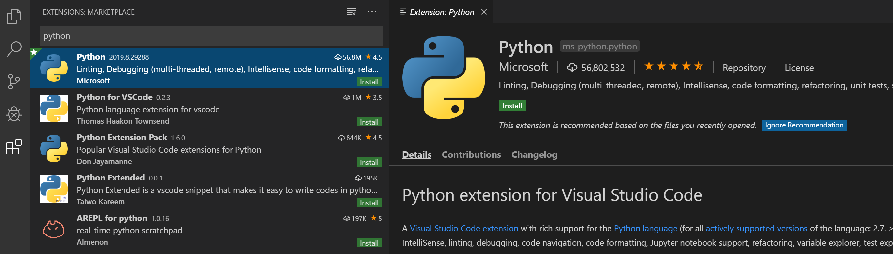
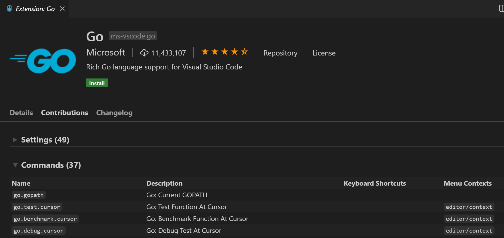
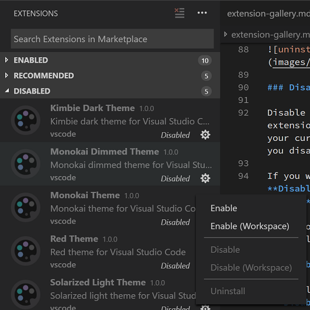

### Instalar extensiones en VS Code

Para instalar extensiones en VS Code abra la vista de Extensiones haciendo clic en el icono de Extensiones en la Barra de Actividad al costado del Código VS o en el comando **Ver: Extensiones ( Ctrl + Shift + X )**.

Esto le mostrará una lista de las extensiones de VS Code más populares en VS Code Marketplace.

Cada extensión de la lista incluye una breve descripción, el editor, el recuento de descargas y una calificación de cinco estrellas. Puede hacer clic en el elemento de la extensión para mostrar la página de detalles de la extensión donde puede obtener más información.

##### Buscar una extensión

Puede borrar el cuadro de búsqueda en la parte superior de la vista Extensiones y escribir el nombre de la extensión, herramienta o lenguaje de programación que está buscando.

Por ejemplo, al escribir 'python' aparecerá una lista de extensiones de lenguaje Python:

##### Instalar una extensión

Para instalar una extensión, haga clic en el botón Instalar . Una vez que se completa la instalación, el botón Instalar cambiará al botón Administrar engranaje.

##### Administar extensiones

VS Code facilita la administración de sus extensiones. Puede instalar, deshabilitar, actualizar y desinstalar extensiones a través de la vista Extensiones, la paleta de comandos (los comandos tienen el prefijo Extensiones : ) o modificadores de línea de comandos.

###### Lista de extensiones instaladas

De forma predeterminada, la vista Extensiones mostrará las extensiones que tiene habilitadas actualmente, todas las extensiones que se recomiendan para usted y una vista contraída de todas las extensiones que ha deshabilitado. Puede usar el comando **Mostrar extensiones instaladas** , disponible en la **paleta de comandos ( Ctrl + Shift + P )** o el menú desplegable **Más acciones** ( ...), para borrar cualquier texto en el cuadro de búsqueda y mostrar la lista de todas las extensiones instaladas, que incluye aquellos que han sido discapacitados.

###### Desinstalar una extensión

Para desinstalar una extensión, haga clic en el botón de engranaje a la derecha de la entrada de una extensión y luego elija **Desinstalar** en el menú desplegable. Esto desinstalará la extensión y le pedirá que vuelva a cargar VS Code.

###### Deshabilitar y habilitar una extensión

Si no desea eliminar permanentemente una extensión, puede desactivarla temporalmente haciendo clic en el botón de engranaje a la derecha de una entrada de extensión. Puede deshabilitar una extensión globalmente o solo para su espacio de trabajo actual. Se le pedirá que vuelva a cargar VS Code después de deshabilitar una extensión.

De manera similar, si ha deshabilitado una extensión (estará en la sección **Deshabilitada** de la lista y marcada como Deshabilitada ), puede volver a habilitarla con los comandos **Habilitar o Habilitar (Área de trabajo)** en el menú desplegable.

