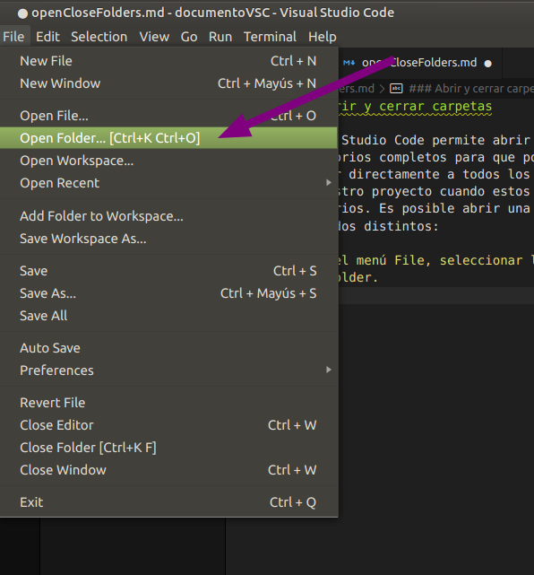
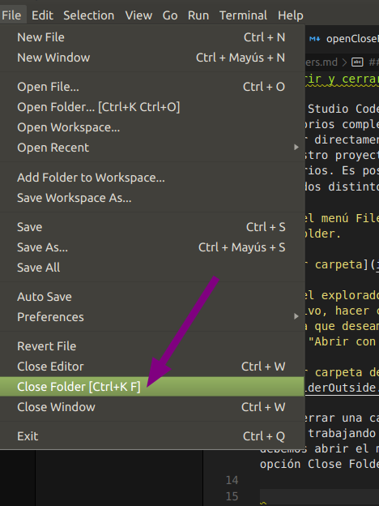

### Abrir y cerrar carpetas

Visual Studio Code permite abrir directorios completos para que podamos acceder directamente a todos los archivos de nuestro proyecto cuando estos sean necesarios. Es posible abrir una carpeta de dos modos distintos:

1. En el menú File, seleccionar la opción Open Folder.

2. En el explorador de archivos del sistema operativo, hacer click derecho en la carpeta que deseamos abrir y pulsar la opción "Abrir con Visual Studio Code".

Para cerrar una carpeta con la que hemos estado trabajando en Visual Studio Code, debemos abrir el menú File y seleccionar la opción Close Folder:

