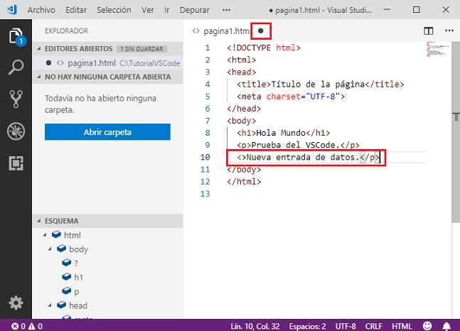
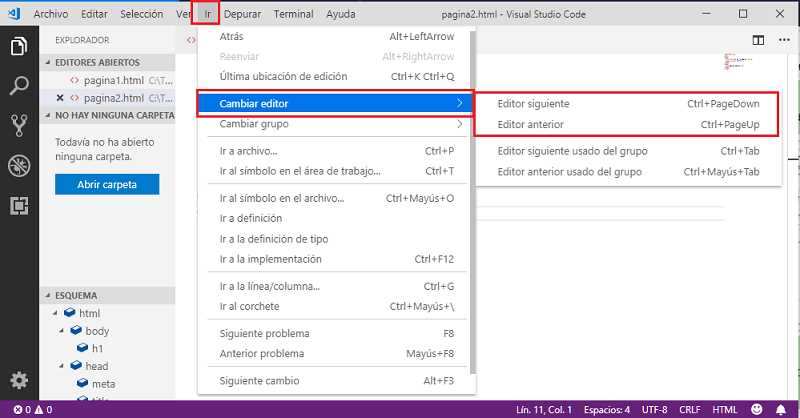
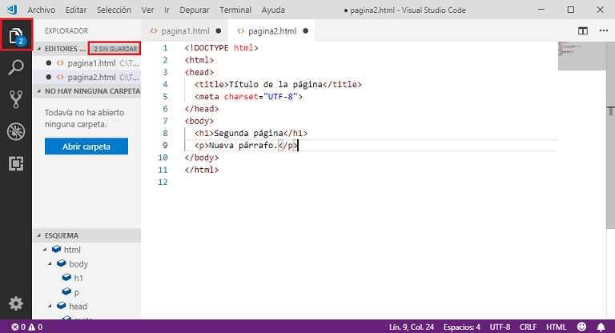
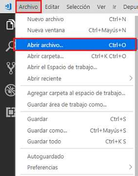
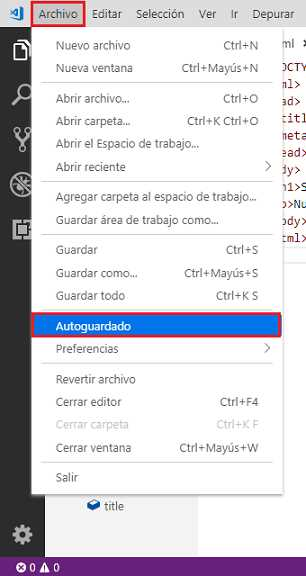

### CREAR-ABRIR-MODIFCAR ARCHIVOS

Creación de un archivo
Desde el menú de opciones de VSCode seleccionamos "Archivo -> Nuevo archivo" (o mediante las teclas de atajo Ctrl + N):

creación de un archivo con VSCode

Ahora en la ventana de edición procederemos a codificar un archivo HTML básico:

Todavía no aparecen las etiquetas HTML coloreadas ya que no hemos guardado el archivo en el disco duro donde indicaremos con la extensión el tipo de archivo.
Para grabar el archivo desde el menú de opciones elegimos "Archivo->guardar" (o mediante las teclas de atajo Ctrl + S):

Ahora seleccionamos en el diálogo la carpeta y nombre de archivo que le asignaremos:

Después de ésta acción el contenido que hemos escrito en VSCode queda almacenado en el archivo 'pagina1.html' en la unidad C:\TutorialVSCode

Si introducimos un cambio con el editor VSCode podemos comprobar que en la pestaña cambia la cruz por un círculo indicando que debemos grabar los cambios introducidos:

Para actualizar los cambios en el archivo debemos seleccionar nuevamente la opción "Archivo guardar" o (Ctrl + S).

Podemos crear varios archivos y tenerlos abiertos en forma simultanea, cada uno en una pestaña diferente.

Creemos nuestro segundo archivo dando los pasos que ya vimos "Archivo -> Nuevo archivo" o (Ctrl + N), luego escribamos nuestra segunda página HTML y la grabemos con la opción "Archivo->guardar" o (Ctrl + S):

Por último desde el menú de opciones de VSCode podemos cambiar entre pestaña seleccionando alguna de las dos opciones: Ir -> Cambiar editor -> Editor siguiente o la Editor anterior:

Grabar todos los archivos modificados.
Para probar esta opción introduzcamos algunos cambios en las dos pestañas de los archivos 'pagina1.html' y pagina2.html'. Podemos ver en el primer ícono de la izquierda que hay dos archivos modificados sin grabar:

Abrir archivos.
Para abrir un archivo almacenado en el disco podemos hacerlo seleccionando desde el menú de opciones: Archivo->Abrir archivo:

El atajo de teclas para que aparezca el diálogo de apertura de archivo es: Ctrl + O.

Crear otro archivo a partir de uno existente.
Es muy común tener que a partir de un archivo existente generar otro. Para esto debemos tener seleccionada la pestaña con el archivo y luego desde el menú de opciones seleccionar 'Archivo -> Guardar como...
Problemas a partir del archivo 'pagina2.html' generar un archivo llamado 'pagina3.html' con el mismo contenido:

Guardado automático.
Si queremos desentendernos de la grabación de los archivos podemos activar la opción de "Autoguardado". Para activar esta funcionalidad en Visual Studio Code debemos ir a la opción de menú: Archivo -> Autoguardado y dejarla tildada (si la seleccionamos nuevamente se desactiva la opción):

 partir de ese momento cada cambio que hagamos a un archivo luego se ven reflejados en el disco donde se almacena (es decir no necesitamos ejecutar 'Archivo->Guardar')