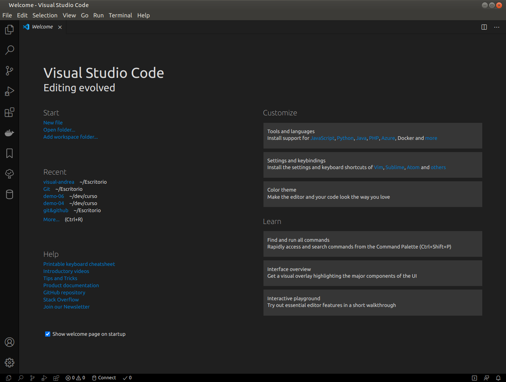

### Características generales de VS Code

VS Code es un editor de código fuente ligero pero potente que se ejecuta en el escritorio y está disponible para Windows, macOS y Linux. Tiene soporte nativo para JavaScript, TypeScript y Node.js. Pero no solo esto, sino que tiene un brutal ecosistema de complementos que permite trabajar con casi cualquier lenguaje de programación, C, C#, Java, Python, PHP, GO, etc.

Combina la interfaz de usuario optimizada de un editor moderno con asistencia y navegación de código enriquecido y una experiencia de depuración integrada. VS Code cuenta con herramientas de Debug hasta opciones para actualización en tiempo real de nuestro código en la vista del navegador y compilación en vivo de los lenguajes que lo requieran. Además de las extensiones, tendremos la posibilidad de optar por otros themes o bien configurarlo a nuestro gusto.

##### Ventajas de VS Code

- VS Code es una herramienta que tiene soporte nativo para gran variedad de lenguajes, entre ellos podemos destacar: HTML, CSS, Javascript, Jquery, PHP, TypeScript, LESS, SCSS, Python, C++, Java...entre otros.
- Autoguardado instantáneo.
- Infinidad de extensiones, la mayoría gratuitas.
- Posibilidad de configurar la interfaz a nuestro gusto. De esta forma, podremos tener más de un código visible al mismo tiempo, las carpetas de nuestro proyecto y también acceso a la terminal o un detalle de problemas, entre otras posibilidades.
- Existencia de una amplísima gama de temas o estilos visuales para VS Code, que hacen el trabajo con el software más agradable a la vista.
- Goza de un soporte técnico formidable pues debido a su frecuente uso por la comunidad de desarrolladores, se puede encontrar fácilmente documentación y ayuda en foros y sitios relacionados.
