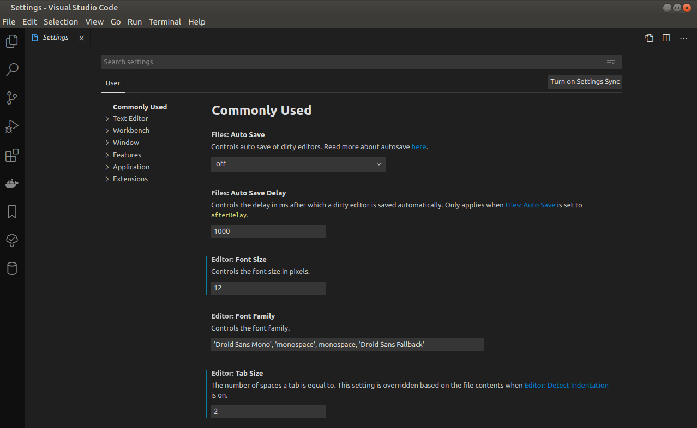

### Configuración de VS Code

Es fácil configurar VS Code al gusto de cada uno a través de sus diversas configuraciones. Casi todas las partes del editor, la interfaz de usuario y el comportamiento funcional de VS Code tienen opciones que puede modificar.

VS Code proporciona dos ámbitos diferentes para la configuración:

- Configuración de usuario : configuración que se aplica globalmente a cualquier instancia de VS Code que abra.
- Configuración del espacio de trabajo : configuración almacenada dentro de su espacio de trabajo y solo se aplica cuando se abre el espacio de trabajo.

La configuración del espacio de trabajo anula la configuración del usuario. La configuración del espacio de trabajo es específica de un proyecto y se puede compartir entre los desarrolladores de un proyecto.

##### Creación de configuraciones de usuario y espacio de trabajo

Para abrir la configuración de usuario y espacio de trabajo, use el siguiente comando de menú de VS Code:

- En Windows / Linux: Archivo > Preferencias > Configuración
- En macOS: Código > Preferencias > Configuración

También puede abrir el editor de configuración desde la paleta de comandos **( Ctrl + Shift + P )** con **Preferencias: Abrir configuración** o usar el método abreviado de teclado **( Ctrl +, )**.

Como se puede ver en la captura anterior, cuando abre el editor de configuración, puede buscar y descubrir la configuración que está buscando. Cuando busque utilizando la barra de búsqueda, no solo mostrará y resaltará las configuraciones que coinciden con sus criterios, sino que también filtrará aquellas que no coinciden. Esto hace que la búsqueda de configuraciones sea rápida y sencilla.

Además, las extensiones de VS Code también pueden agregar sus propias configuraciones personalizadas y estarán visibles en una sección de **Extensiones**.

La edición de configuración de VS Code es muy amplia, como por ejemplo el número de espacios que tiene un tab:

