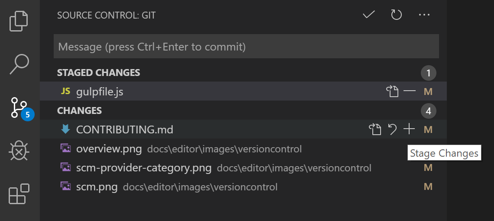

### Control de versiones

VS Code tiene control de fuente integrado e incluye compatibilidad con Git. Muchos otros proveedores de control de fuente están disponibles a través de extensiones en VS Code Marketplace.

##### Control de versiones Git

VS Code aprovechará la instalación de Git de su máquina, por lo que primero debe **instalar Git** antes de obtener estas funciones. Asegúrese de instalar al menos la versión 2.0.0.

El icono de Source Control a la izquierda siempre indicará una descripción general de cuántos cambios tiene actualmente en su repositorio. Al hacer clic en él, se mostrarán los detalles de los cambios de su repositorio actual: **CAMBIOS , CAMBIOS DEL STAGED y FUSIONAR CAMBIOS**.

Al hacer clic en cada elemento, se le mostrarán en detalle los cambios textuales dentro de cada archivo . Tenga en cuenta que para los cambios fuera del staged, el editor de la derecha aún le permite editar el archivo: ¡no dude en usarlo!

También puede encontrar indicadores del **estado de su repositorio** en la esquina inferior izquierda de VS Code: la **rama actual** , **indicadores sucios** y el número de **commits entrantes y salientes** de la rama actual. Puede **verificar** cualquier rama de su repositorio haciendo clic en ese indicador de estado y seleccionando la referencia de Git de la lista.

**Staging** (git add) y **unstaging** (git reset) se pueden realizar mediante acciones contextuales en los archivos o arrastrando y soltando.

En la barra de "Message" puede escribir un mensaje de commit sobre los cambios y presionar Ctrl + Enter (macOS: ⌘ + Enter ) para confirmarlos. Si hay cambios por etapas, solo se confirmarán; de lo contrario, se confirmarán todos los cambios.
